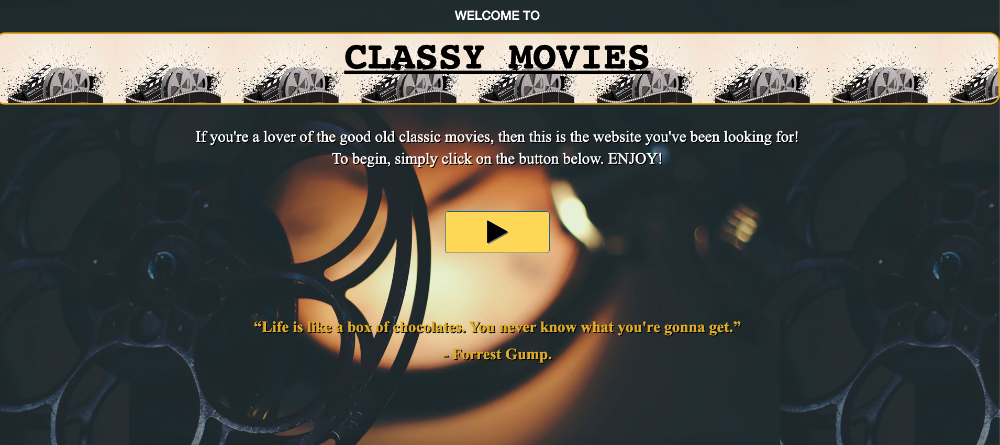
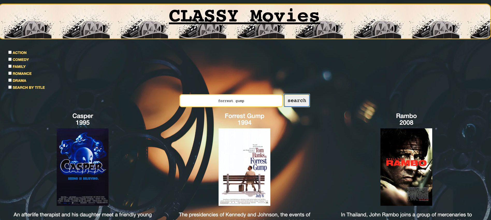
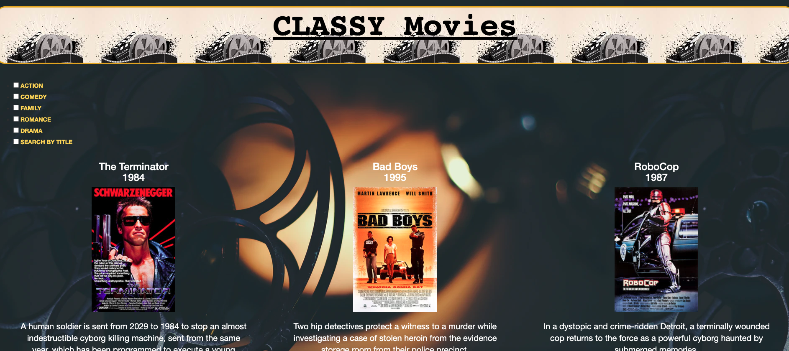

# Classy Movies

## Contributors

* Kevin Floris
* Jennifer Mendez
* Esteban Mendez

## User Story

As a user, who loves good old classy movies, I want the application to:  

1. Display the data of the movie that I search for. This includes movie title, year, poster, and plot. 
2. Be able to click on a specific genre and get a list of movies for the genre that I clicked on.
3. Be able to click on the poster of the movie and be directed to a youTube video trailer of that movie. 

## Table of Content

* [Motivation](#motivation)
* [Description](#description)
* [Requirements](#requirements)
* [Screenshots](#screenshots)
* [Link to Page](#link-to-page)
* [Tools](#tools)

## Motivation

We want users to be able to quickly find classic movies that they loved when they were younger, and that can bring back fond memories of their childhood, time in high school, or simply any other memory that reminds them how things were back then.

## Description

Create a Classy Movie application that allows you to search for any classic movies. This app will run in the browser and feature dynamically updated HTML and CSS powered by jQuery. Use omd movie api for requesting the movie data, and themoviedb api for the movie trailer. 

## Requirements 

The Classy Movie application should have the following:

* When I open the page, I am presented with a welcoming message and a button that will bring me to 
the search movie page.
* When I click on the play button, then I am presented with the movie search page. This page contains different movie genres, and also a search box so that I can type a movie title. 
* When I type in a movie title in the search box and click the search button, then the data of the movie that I requested is rendered on the page. I can see the movie's title, year, poster, a plot description.
* When I search for another movie, then the previously searched movies are saved and displayed on the page.
* When I want to get a pre-selected list of movies by genre, then I can click on one of the movie genres that are showing on the page.
* When I get a list of movies by genre, then I can see the data of the movie. 
* When I click on the poster of the movie I requested, then I am able to watch the trailer of that movie. 

## Screenshots

## Link to Page

<https://esmendez90.github.io/classy-movies/>

## Tools

* Visual Studio Code <https://code.visualstudio.com>.
* Chrome DevTools - Inspect.
* OMDB API <https://www.omdbapi.com/>.
* themoviedb API <https://www.themoviedb.org/documentation/api>